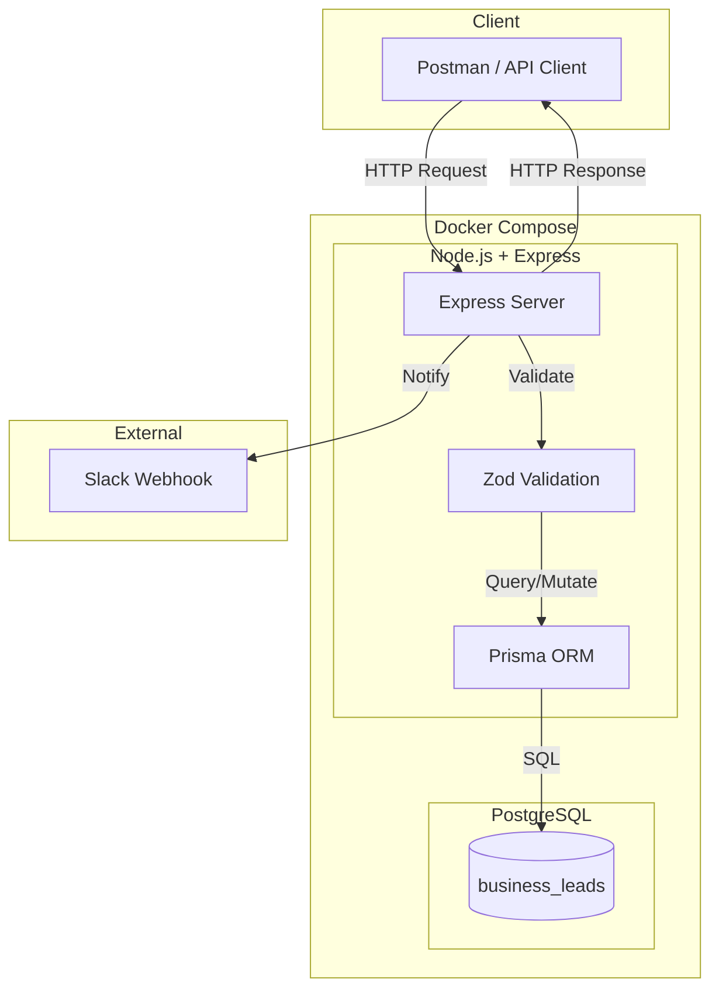

# Business Lead Tracker

> *"The name of the game... is getting them to say yes."*


---

## The Problem Statement

A lead comes in. It sits in someone's inbox. By the time your team finds out, the prospect signed with a competitor.

**This tool fixes that.** New lead? Slack notification. Deal closed? Slack notification. Your team stays in sync. No lead falls through the cracks.

---

## How It Works

1. **Add a lead** → Team gets notified instantly on Slack
2. **Track progress**: `NEW` → `CONTACTED` → `CALL_DONE` → `DEAL` or `LOST`
3. **Close the deal** → Team gets notified → Customer exits the sales funnel

### Slack Notification


---

## Architecture

### High-Level Overview



### Request Flow (File to File)


---

## Tech Stack

| Component | Technology |
|-----------|------------|
| Runtime | Node.js 22 + TypeScript |
| Framework | Express 5 |
| Database | PostgreSQL 15 + Prisma 7 |
| Validation | Zod 4 |
| Notifications | Slack Webhooks |
| Containerization | Docker Compose |

### Database & ORM

This project uses **PostgreSQL** with **Prisma ORM** and the `@prisma/adapter-pg` for data access.

**Why a relational database?**
- The data model is highly structured
- Constraints like unique email enforcement are important
- Strong consistency guarantees are required for lead state transitions and notifications

Currently, the app uses a single `Lead` table — sufficient for the domain without premature complexity. If it scales, we can normalize into additional tables (Companies, Contacts, Activities) later.

### Database Schema

| Column | Type | Constraints | Description |
|--------|------|-------------|-------------|
| `id` | `INT` | `PRIMARY KEY`, Auto-increment | Unique identifier |
| `companyName` | `STRING` | Required | Company name |
| `contactName` | `STRING` | Required | Contact person's name |
| `email` | `STRING` | `UNIQUE`, Required | Contact email (prevents duplicates) |
| `source` | `ENUM` | Required | Lead source: `LINKEDIN`, `INTRO`, `INBOUND`, `OTHER` |
| `status` | `ENUM` | Default: `NEW` | Lead status: `NEW`, `CONTACTED`, `CALL_DONE`, `DEAL`, `LOST` |
| `newLeadNotification` | `ENUM` | Default: `PENDING` | Slack notification state for new lead |
| `dealClosedNotification` | `ENUM` | Default: `PENDING` | Slack notification state for deal closure |
| `createdAt` | `DATETIME` | Auto-generated | Record creation timestamp |
| `updatedAt` | `DATETIME` | Auto-updated | Last modification timestamp |

---

## Getting Started

### Prerequisites

| Requirement | Installation |
|-------------|--------------|
| **Docker** | [docker.com/get-docker](https://www.docker.com/get-docker) |
| **Docker Compose** | Included with Docker Desktop (Mac/Windows). Linux: `sudo apt install docker-compose` |
| **Git** | [git-scm.com](https://git-scm.com/) |
| **Postman** | [postman.com/downloads](https://www.postman.com/downloads/) (for API testing) |

Optional: [VS Code](https://code.visualstudio.com/) or any code editor to view/edit files.

### Step 1: Get a Slack Webhook URL

Before running the app, you need a Slack Incoming Webhook:

1. Go to [api.slack.com/apps](https://api.slack.com/apps) → Click **Create New App** → Choose **From scratch**
2. Go to **Incoming Webhooks** → Toggle **Activate Incoming Webhooks** to **On**
3. Click **Add New Webhook to Workspace** → Select your channel → Click **Authorize**
4. Copy the webhook URL (looks like `https://hooks.slack.com/services/T.../B.../xxx`)

📚 [Official Slack Webhook Documentation](https://docs.slack.dev/messaging/sending-messages-using-incoming-webhooks/)

### Step 2: Clone and Configure

```bash
git clone https://github.com/arjunthazhath2001/lead-tracker.git
cd lead-tracker
```

Create a `.env` file with your Slack webhook:

**Mac / Linux:**
```bash
echo 'SLACK_WEBHOOK_URL=https://hooks.slack.com/services/YOUR/WEBHOOK/URL' > .env
```

**Windows (PowerShell):**
```powershell
"SLACK_WEBHOOK_URL=https://hooks.slack.com/services/YOUR/WEBHOOK/URL" | Out-File -Encoding utf8 .env
```

**Windows (CMD):**
```cmd
echo SLACK_WEBHOOK_URL=https://hooks.slack.com/services/YOUR/WEBHOOK/URL > .env
```

Or just create a `.env` file manually and paste:
```
SLACK_WEBHOOK_URL=https://hooks.slack.com/services/YOUR/WEBHOOK/URL
```

### Step 3: Start the Application

```bash
docker-compose up --build
```

This will:
- Pull PostgreSQL 15 image
- Build the Node.js application
- Run database migrations automatically
- Start the API server

**API is ready at `http://localhost:3001`**

### Step 4: Test with Postman

1. Open Postman → Click **Import**
2. Select `postman/Business Lead tracker API.postman_collection.json`
3. Set base URL to `http://localhost:3001`
4. Execute requests to test the API

---

## API Endpoints

| Method | Endpoint | Description |
|--------|----------|-------------|
| `POST` | `/leads` | Create a new lead |
| `GET` | `/leads` | Get all leads (optionally filter by `?status=NEW`) |
| `PATCH` | `/leads/:id` | Update lead status |

### API Testing with Postman

The included Postman collection demonstrates:

- Happy path API usage
- Input validation errors
- Domain and resource errors (duplicate email, lead not found)
- System failure scenarios (Slack webhook failure)
- Retry behavior after system recovery

The collection serves as both documentation and an executable test suite.

---

## Assumptions & Design Decisions

This backend service was built with the following assumptions in mind:

### Lead & Company Modeling

- A company may have multiple leads, each identified by a **unique email address**
- Email uniqueness is enforced at the database level
- Multiple contacts from the same company are supported as long as their emails differ

### State Transitions

- Lead status transitions are **flexible** — you can move back from `DEAL` to earlier states if business circumstances change
- Status updates are **idempotent** — re-submitting the same status doesn't create side effects unless needed for recovery

### Notification Handling

The core value of this app is **instant team notification**. A lead that nobody knows about is a lead that gets lost.

Most apps treat notifications as fire-and-forget. We don't. **Slack notifications are a critical business event**, so we persist their state:

| State | Meaning |
|-------|---------|
| `PENDING` | Lead created, notification not yet attempted |
| `SENT` | Slack notification delivered successfully |
| `FAILED` | Slack was down or unreachable — needs retry |

This means:
- If Slack fails, **the lead is still saved** (we don't lose business data)
- Failed notifications are explicitly tracked and can be retried
- The `PATCH /leads/:id` endpoint automatically retries failed notifications

**The database is the source of truth. Slack is the delivery mechanism.**

### Other Decisions

- **Single user, no auth** — Internal tool for small teams. Auth is a future enhancement.
- **Selective notifications** — Only for `NEW` leads and `DEAL` closures. No Slack spam.

---

## Future Improvements

- [ ] Multi-user auth via Clerk/Auth0
- [ ] Lead assignment to team members
- [ ] Activity history & audit log
- [ ] React/Next.js dashboard
- [ ] Analytics & conversion tracking

---

*Built for teams that don't let leads slip away.*
